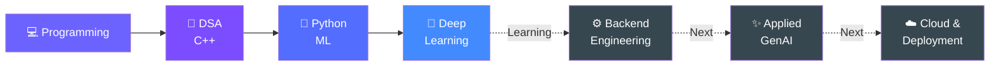

<div align="center">

# Hey, I'm Diksha 👋

### Software Engineering × Applied AI

**C++ • Python • Machine Learning • Building & Learning in Public**

<br>

> *Learning how to build software that goes beyond "it works on my laptop."*

<br>

[](https://www.linkedin.com/in/diksha-sirohi-b8528228b/)
[](https://leetcode.com/u/Diksha_Sirohi/)

</div>

---

## 👩‍💻 A little about me

I'm a Computer Science & Engineering (Data Science) student who enjoys
**building things, breaking them, figuring out why they broke, and making them better.**

My strongest experience so far is in **Python, machine learning and deep learning**, and I'm currently putting serious effort into becoming a stronger **software engineer** alongside that.

Right now you'll probably find me:

- 🧩 solving DSA problems in **C++** and getting comfortable with the STL
- 🐍 building and experimenting with **Python**
- 🧠 working with **deep learning / computer vision**
- ⚙️ learning how **backend systems and APIs** actually work
- 🔨 improving old projects instead of abandoning them for shiny new ones

I'm still early in the journey — this profile is where I'm documenting the progress.

---

## 🌿 Project I'm Most Proud Of

### Plant Disease Detection System

`Python` `TensorFlow` `Keras` `Transfer Learning` `Streamlit` `Grad-CAM`

A deep-learning system for identifying plant diseases from leaf images across
**38 healthy and diseased classes**.

What started as a college ML project turned into a much deeper experiment with
different architectures and training strategies.

**Some things I explored:**

- MobileNetV2 as my initial transfer-learning model
- EfficientNetB0 as an improved architecture
- fine-tuning
- stronger image augmentation
- class weighting
- label smoothing
- evaluation on a separate test set
- Grad-CAM for understanding model predictions
- a Streamlit interface for predictions

### The result

**~93% MobileNetV2 → ~99% EfficientNetB0 test accuracy**

But accuracy isn't where I want the project to end.

I'm currently learning the engineering needed to eventually add things like
an inference API, tests, Docker, CI/CD and deployment — **one piece at a time,
and only after I understand what I'm adding.**

### → [Explore the project](https://github.com/DikshaSirohi/plant-disease-detection)

---

## 🗺️ Where I Am → Where I'm Going



**Solid arrows = areas I've already worked with**  
**Dotted arrows = what I'm currently learning / moving toward**

No speedrun. I want to actually understand each layer.

---

## 🧰 What I've Actually Worked With

<div align="center">


</div>

Also worked with:

`C` • `JavaScript` • `HTML/CSS` • `Streamlit` • `GitHub` • `AWS guided labs`

---

## 📚 Currently Learning

This is the part of my stack that's **under construction** 🚧

| Area | Current Focus |
|---|---|
| 🧩 **DSA** | C++ STL, patterns & problem solving |
| ⚙️ **Backend** | Python, HTTP, REST APIs & FastAPI fundamentals |
| 🗄️ **Databases** | SQL fundamentals → PostgreSQL |
| 🧪 **Engineering** | Testing & better project structure |
| 🤖 **Applied AI** | LLM fundamentals, embeddings & RAG |
| ☁️ **Deployment** | Docker, CI/CD & AWS — progressively |

**Learning ≠ claiming mastery.**

As I build projects with these, they'll move out of this section and into my actual stack.

---

## 🔨 What I'm Building Next

### Codebase Intelligence / Developer Support System

I'm starting a new project around a question I find interesting:

> **Can we build a system that actually understands enough context from a
> codebase to help a developer navigate it?**

Eventually, I'd like it to work with repositories and documentation to retrieve
relevant code and answer questions with evidence from the source.

Right now?

**I'm starting with the fundamentals.**

```text
Learn backend basics
        ↓
Build a simple API
        ↓
Understand repository ingestion
        ↓
Learn embeddings & retrieval
        ↓
Build basic RAG
        ↓
Evaluate whether it actually works
        ↓
Improve the engineering around it
```

I'll build this repository progressively rather than uploading a finished
AI-generated codebase.

---

## 🎯 Current Mission

```text
Write more code.
Understand more of the code I write.
Solve harder problems.
Build fewer — but better — projects.
Ship things that actually work.
```

My GitHub today isn't supposed to represent the engineer I want to be in
three years.

**It's supposed to show that I'm becoming one.**

---

<div align="center">

### Find me elsewhere

[](https://www.linkedin.com/in/diksha-sirohi-b8528228b/)
[](https://leetcode.com/u/Diksha_Sirohi/)

<br>

### `learn → build → break → debug → improve → ship`

</div>
