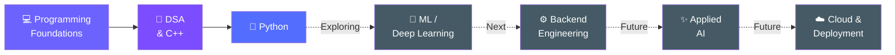

<div align="center">

# Hey, I'm Diksha 👋

### Building toward Software Engineering × Applied AI

**C++ • Python • Exploring ML/AI • Learning by Building**

<br>

> *Building projects, strengthening fundamentals, and learning along the way.*

<br>

[](https://www.linkedin.com/in/diksha-sirohi-b8528228b/)
[](https://leetcode.com/u/Diksha_Sirohi/)

</div>

---

## 👩‍💻 A Little About Me

I'm a Computer Science & Engineering (Data Science) student who likes figuring out
**how things work, why they break, and how to make them better.**

I'm currently strengthening my **programming and problem-solving foundations**, while gradually exploring **software engineering, machine learning, and applied AI** through hands-on projects.

Right now, I'm focused on:

- 🧩 improving my problem-solving skills with **C++ & DSA**
- 🧰 getting more comfortable with **C++ STL**
- 🐍 strengthening my **Python** fundamentals
- 🔨 improving projects I've already built instead of constantly starting new ones

I'm still early in the journey — and this profile will grow as I do.

---

## 🌿 Project I'm Most Proud Of

### Plant Disease Detection System

`Python` `TensorFlow` `Keras` `Transfer Learning` `Streamlit`

A deep-learning project for identifying plant diseases from leaf images across
**38 healthy and diseased classes**.

I experimented with different transfer-learning architectures and training
strategies while building the project.

### 🔬 What I worked with

- **MobileNetV2** as an initial transfer-learning model
- **EfficientNetB0** as an improved architecture
- Fine-tuning
- Image augmentation
- Class weighting
- Label smoothing
- Evaluation on a separate test dataset
- A **Streamlit** interface for predictions

### 📈 Experimentation

**MobileNetV2 (~93%) → EfficientNetB0 (~99%) test accuracy**

The model works, but I don't want the project to stop at model accuracy.

As I learn more software engineering, I plan to revisit this project and gradually
improve its structure, testing, deployment and overall engineering quality.

### → [Explore the project](https://github.com/DikshaSirohi/plant-disease-detection)

---

## 🗺️ Where I Am → Where I'm Going



**Solid arrows → foundations I'm currently building**  
**Dotted arrows → areas I'm exploring or plan to learn next**

I'm not trying to speedrun the stack. I want to understand each layer well enough
to actually build with it.

---

## 🧰 Current Toolkit

These are technologies I've used or had exposure to through projects,
coursework and practice.

<div align="center">


</div>

<br>

Also exposed to:

`JavaScript` • `HTML/CSS` • `Streamlit` • `GitHub` • `AWS guided labs`

---

## 📚 What I'm Learning Now

| Area | Focus |
|---|---|
| 🧩 **DSA** | C++ problem solving & pattern recognition |
| 🧰 **C++** | STL and writing cleaner solutions |
| 🐍 **Python** | Strengthening programming fundamentals |
| 🧠 **ML/AI** | Understanding the fundamentals behind what I build |
| 🌿 **Projects** | Improving code quality and understanding my existing work |

---

## 🔭 What's Next

There are several areas I want to progressively learn as my fundamentals improve:

```text
Backend fundamentals
        ↓
HTTP & REST APIs
        ↓
FastAPI
        ↓
Databases / PostgreSQL
        ↓
Testing
        ↓
Docker
        ↓
Applied AI / RAG
        ↓
CI/CD & Deployment
```

These are **learning goals, not technologies I'm claiming to know yet.**

As I actually learn and build with them, they'll move into my current toolkit.

---

## 💡 A Project I Want to Build

### Codebase Intelligence / Developer Support System

One of the larger projects I eventually want to build is a system that helps
developers understand and navigate software repositories.

The idea is to eventually explore things like:

- retrieving relevant code and files
- understanding repository context
- working with documentation
- answering questions using retrieved evidence
- exploring how retrieval and LLMs can work together

But I'm **not building the complicated version first**.

Before starting it properly, I want to understand the backend and software
engineering fundamentals that the project would depend on.

So the progression will be closer to:

```text
Learn the fundamentals
        ↓
Build small components
        ↓
Understand how they connect
        ↓
Build the actual system
        ↓
Test whether it works
        ↓
Improve it
```

---

## 🎯 Current Mission

```text
Write more code.
Understand more of the code I write.
Get better at problem solving.
Build fewer — but better — projects.
Keep improving.
```

I don't expect this GitHub profile to represent the engineer I want to be
three years from now.

**I want it to show the progress toward becoming one.**

---

<div align="center">

### Let's Connect

[](https://www.linkedin.com/in/diksha-sirohi-b8528228b/)
[](https://leetcode.com/u/Diksha_Sirohi/)

<br>

### `learn → build → understand → improve → repeat`

</div>
